# BGP — Roteamento entre ISPs

## Objetivo

Este documento descreve a implementação do **eBGP (External Border Gateway Protocol)** entre os três roteadores que representam os provedores de Internet do laboratório.

O objetivo é simular uma topologia de múltiplos sistemas autônomos, permitindo que os diferentes ISPs troquem informações de roteamento e forneçam caminhos alternativos para alcançar as redes anunciadas pelos demais AS.

Os provedores são identificados no projeto como:

| Equipamento | Identificação |     ASN |
| ----------- | ------------- | ------: |
| ISP-01      | ISP-01        | `65001` |
| ISP-02      | ISP-02        | `65002` |
| ISP-03      | ISP-03        | `65003` |

---

# 1. Topologia BGP

Os três ISPs possuem sessões eBGP entre si, formando uma topologia de malha completa.

```text id="e6j9xw"
                     ISP-01
                    AS 65001
                   /        \
                  /          \
                 /            \
        ISP-02 --------------- ISP-03
       AS 65002              AS 65003
```

As conexões de trânsito utilizadas entre os AS são:

| Sessão          | Rede            | ISP origem | ISP destino |
| --------------- | --------------- | ---------- | ----------- |
| ISP-01 ↔ ISP-02 | `10.255.1.0/30` | AS 65001   | AS 65002    |
| ISP-01 ↔ ISP-03 | `10.255.2.0/30` | AS 65001   | AS 65003    |
| ISP-02 ↔ ISP-03 | `10.255.3.0/30` | AS 65002   | AS 65003    |

### Evidência — Topologia BGP

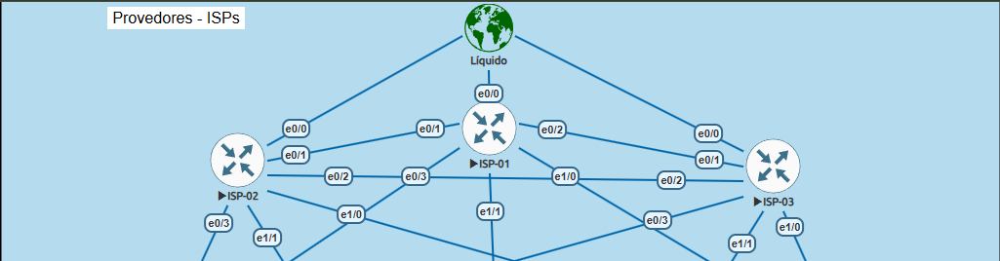

---

# 2. Sistemas Autônomos

Cada roteador representa um sistema autônomo independente.

```text
ISP-01 → AS 65001
ISP-02 → AS 65002
ISP-03 → AS 65003
```

O uso de ASNs distintos permite estabelecer sessões **eBGP** entre os roteadores.

A comunicação BGP utiliza TCP/179.

---

# 3. Vizinhanças eBGP

As sessões configuradas são:

```text
ISP-01 AS 65001
      |
      | eBGP
      |
ISP-02 AS 65002
```

```text
ISP-01 AS 65001
      |
      | eBGP
      |
ISP-03 AS 65003
```

```text
ISP-02 AS 65002
      |
      | eBGP
      |
ISP-03 AS 65003
```

Cada roteador possui dois vizinhos BGP.

### Evidência — Configuração dos Neighbors

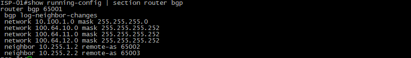

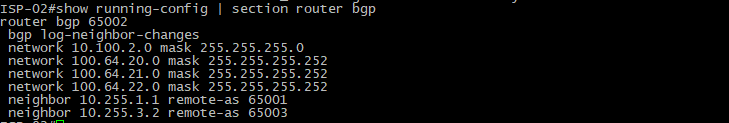

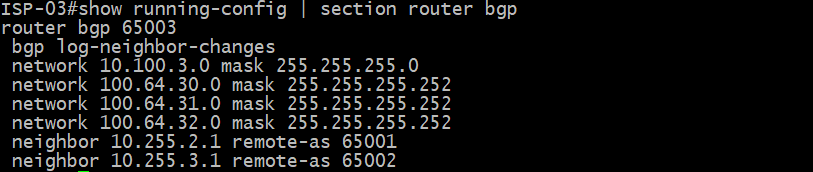

---

# 4. Redes Anunciadas

Cada ISP possui uma rede própria anunciada através do BGP.

| ISP    |     ASN | Prefixo anunciado |
| ------ | ------: | ----------------- |
| ISP-01 | `65001` | `10.100.1.0/24`   |
| ISP-02 | `65002` | `10.100.2.0/24`   |
| ISP-03 | `65003` | `10.100.3.0/24`   |

Esses prefixos representam redes pertencentes aos respectivos sistemas autônomos.

As redes são mantidas na tabela de roteamento local através de uma rota para `Null0`, permitindo que sejam anunciadas pelo processo BGP.

Exemplo conceitual:

```text
ISP-01
  |
  +---- 10.100.1.0/24
  |
  +---- Null0
```

O mesmo princípio é utilizado nos demais ISPs.

### Evidência — Prefixos Locais

> **[IMAGEM 03 — INSERIR AQUI]**

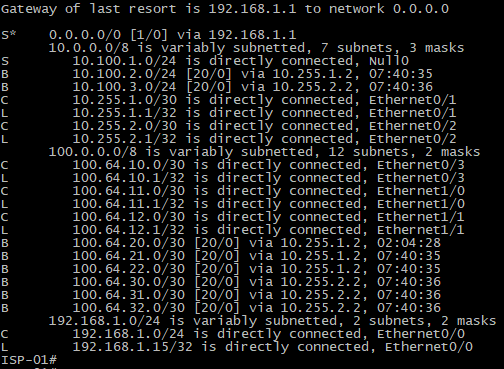

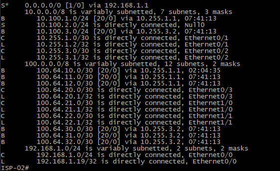

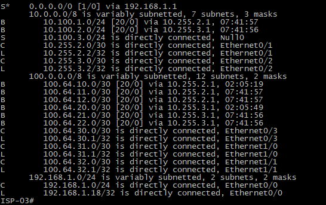

---

# 5. Anúncio dos Prefixos

Cada ISP anuncia seu próprio prefixo aos vizinhos BGP.

Exemplo:

```text
ISP-01
10.100.1.0/24
     |
     +------> ISP-02
     |
     +------> ISP-03
```

O ISP-02 anuncia:

```text
10.100.2.0/24
```

E o ISP-03 anuncia:

```text
10.100.3.0/24
```

Como consequência, os roteadores passam a conhecer redes pertencentes aos demais AS.

---

# 6. Aprendizado de Rotas

Após o estabelecimento das sessões BGP, cada roteador aprende os prefixos anunciados pelos outros AS.

Exemplo no ISP-01:

```text
10.100.2.0/24 → aprendido via ISP-02
10.100.3.0/24 → aprendido via ISP-03
```

Exemplo no ISP-02:

```text
10.100.1.0/24 → aprendido via ISP-01
10.100.3.0/24 → aprendido via ISP-03
```

Exemplo no ISP-03:

```text
10.100.1.0/24 → aprendido via ISP-01
10.100.2.0/24 → aprendido via ISP-02
```

### Evidência — Tabela BGP

> **[IMAGEM 04 — INSERIR AQUI]**


---

# 7. BGP e Seleção de Caminho

Como existe uma malha entre os três AS, alguns destinos podem possuir mais de um caminho possível.

Exemplo:

```text
ISP-01
  |
  +-------- ISP-02
  |            |
  |            |
  +-------- ISP-03
```

Para alcançar um prefixo pertencente ao ISP-03, o ISP-01 pode possuir caminhos através de diferentes vizinhos dependendo da topologia e dos atributos BGP.

O BGP utiliza atributos para selecionar o melhor caminho.

Entre os atributos relevantes estão:

* AS Path;
* Local Preference;
* Weight;
* MED;
* Next Hop;
* Origem da rota.

Neste laboratório, o principal objetivo é demonstrar o funcionamento do **eBGP e da propagação de rotas entre diferentes AS**.

---

# 8. AS Path

O atributo AS Path permite visualizar por quais sistemas autônomos uma rota passou.

Exemplo conceitual:

```text
10.100.3.0/24
AS Path: 65003
```

Caso o prefixo seja aprendido através de outro AS:

```text
10.100.3.0/24
AS Path: 65002 65003
```

Isso permite identificar o caminho percorrido pela informação de roteamento.

Também existe um mecanismo importante de prevenção de loops: um roteador BGP não aceita normalmente uma rota cujo AS local já esteja presente no AS Path.

---

# 9. Rotas de Trânsito

Os ISPs também funcionam como redes de trânsito entre os diferentes AS.

Exemplo:

```text
Rede 10.100.1.0/24
        |
        v
    ISP-01
        |
        v
    ISP-02
        |
        v
Rede 10.100.2.0/24
```

O objetivo é representar o comportamento de uma infraestrutura de múltiplos provedores, onde informações de roteamento são propagadas entre diferentes sistemas autônomos.

---

# 10. Prefixos WAN do Laboratório

Além dos prefixos próprios dos ISPs, o ambiente possui redes WAN utilizadas para conectar os equipamentos da infraestrutura corporativa aos provedores.

### Matriz

```text
ISP-01 → 100.64.10.0/30
ISP-02 → 100.64.20.0/30
ISP-03 → 100.64.30.0/30
```

### Filial

```text
ISP-01 → 100.64.11.0/30
ISP-02 → 100.64.21.0/30
ISP-03 → 100.64.31.0/30
```

Essas redes fazem parte da representação lógica da conectividade WAN do laboratório.

A faixa `100.64.0.0/10` é utilizada exclusivamente como representação de conectividade WAN dentro deste ambiente de laboratório.

---

# 11. Validação das Sessões

A primeira etapa de validação consiste em verificar o estado dos vizinhos BGP.

Comandos utilizados nos roteadores Cisco:

```bash
show ip bgp summary
```

e:

```bash
show ip bgp neighbors
```

O estado esperado dos vizinhos é:

```text
Established
```

Uma sessão em estado `Established` indica que a adjacência BGP foi estabelecida e que os roteadores podem trocar informações de roteamento.

### Evidência — BGP Summary

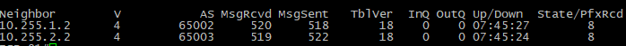

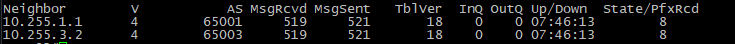

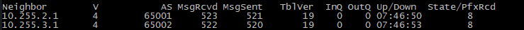

---

# 12. Validação das Rotas

Após confirmar as sessões, são verificadas as rotas aprendidas.

Comandos utilizados:

```bash
show ip bgp
```

```bash
show ip route bgp
```

Para verificar um prefixo específico:

```bash
show ip bgp 10.100.2.0
```

### Evidência — Rotas BGP

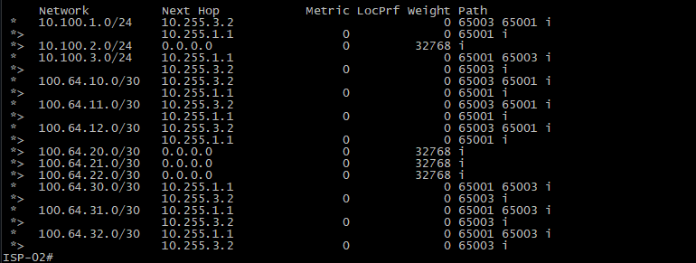

---

# 13. Teste de Conectividade

A validação funcional consiste em testar a comunicação entre redes pertencentes aos diferentes AS.

Exemplo:

```text
10.100.1.0/24
      |
      v
   ISP-01
      |
      v
   ISP-02
      |
      v
10.100.2.0/24
```

Podem ser utilizados:

```bash
ping <destino>
```

e:

```bash
traceroute <destino>
```

O `traceroute` é especialmente útil para verificar o caminho percorrido pelo tráfego.

### Evidência — Teste de Reachability

ISP-01#ping 10.255.1.2
Type escape sequence to abort.
Sending 5, 100-byte ICMP Echos to 10.255.1.2, timeout is 2 seconds:
!!!!!
Success rate is 100 percent (5/5), round-trip min/avg/max = 1/2/5 ms
ISP-01#ping 10.255.2
% Unrecognized host or address, or protocol not running.

ISP-01#ping 10.255.2.2
Type escape sequence to abort.
Sending 5, 100-byte ICMP Echos to 10.255.2.2, timeout is 2 seconds:
!!!!!
Success rate is 100 percent (5/5), round-trip min/avg/max = 1/2/5 ms

ISP-02#ping 10.255.1.1
Type escape sequence to abort.
Sending 5, 100-byte ICMP Echos to 10.255.1.1, timeout is 2 seconds:
!!!!!
Success rate is 100 percent (5/5), round-trip min/avg/max = 1/1/1 ms
ISP-02#ping 10.255.3.2
Type escape sequence to abort.
Sending 5, 100-byte ICMP Echos to 10.255.3.2, timeout is 2 seconds:
!!!!!
Success rate is 100 percent (5/5), round-trip min/avg/max = 1/4/5 ms

ISP-03#ping 10.255.2.1
Type escape sequence to abort.
Sending 5, 100-byte ICMP Echos to 10.255.2.1, timeout is 2 seconds:
!!!!!
Success rate is 100 percent (5/5), round-trip min/avg/max = 1/1/1 ms
ISP-03#ping 10.255.3.1
Type escape sequence to abort.
Sending 5, 100-byte ICMP Echos to 10.255.3.1, timeout is 2 seconds:
!!!!!
Success rate is 100 percent (5/5), round-trip min/avg/max = 1/1/1 ms

---

# 14. Troubleshooting

A análise de problemas BGP segue uma abordagem por camadas:

```text
Interface
    ↓
Endereço IP
    ↓
Conectividade entre vizinhos
    ↓
TCP/179
    ↓
Sessão BGP
    ↓
Anúncio de prefixos
    ↓
Aprendizado de rotas
    ↓
Instalação na RIB
    ↓
Forwarding
```

### 14.1 Sessão não estabelece

Verificar:

```bash
show ip interface brief
```

```bash
ping <IP-do-vizinho>
```

```bash
show ip bgp summary
```

Possíveis causas:

* Interface indisponível;
* Endereço IP incorreto;
* ASN remoto incorreto;
* Endereço do neighbor incorreto;
* TCP/179 inacessível;
* Configuração BGP inconsistente.

### 14.2 Sessão estabelecida, mas rota não aparece

Verificar:

```bash
show ip bgp
```

```bash
show ip route
```

```bash
show ip bgp neighbors
```

Também deve ser verificado se o prefixo anunciado realmente existe na tabela de roteamento local.

No caso das redes deste laboratório, as rotas para `Null0` garantem a existência dos prefixos utilizados nos anúncios.

### 14.3 Rota recebida, mas não instalada

Nesse cenário, a análise deve considerar:

* Melhor caminho BGP;
* Next-hop;
* RIB;
* Outros caminhos disponíveis;
* Atributos BGP;
* Existência de uma rota preferencial.

---

# 15. Evidências Consolidadas

As principais evidências da implementação BGP são:


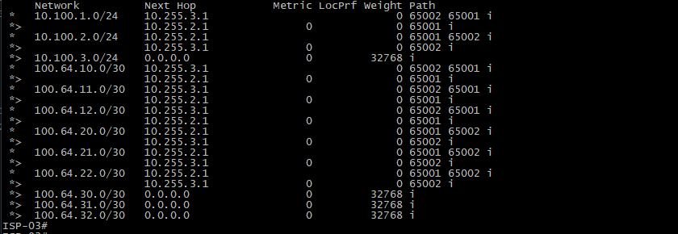

ISP-01#ping 10.255.1.2
Type escape sequence to abort.
Sending 5, 100-byte ICMP Echos to 10.255.1.2, timeout is 2 seconds:
!!!!!
Success rate is 100 percent (5/5), round-trip min/avg/max = 1/2/5 ms
ISP-01#ping 10.255.2
% Unrecognized host or address, or protocol not running.

ISP-01#ping 10.255.2.2
Type escape sequence to abort.
Sending 5, 100-byte ICMP Echos to 10.255.2.2, timeout is 2 seconds:
!!!!!
Success rate is 100 percent (5/5), round-trip min/avg/max = 1/2/5 ms

ISP-02#ping 10.255.1.1
Type escape sequence to abort.
Sending 5, 100-byte ICMP Echos to 10.255.1.1, timeout is 2 seconds:
!!!!!
Success rate is 100 percent (5/5), round-trip min/avg/max = 1/1/1 ms
ISP-02#ping 10.255.3.2
Type escape sequence to abort.
Sending 5, 100-byte ICMP Echos to 10.255.3.2, timeout is 2 seconds:
!!!!!
Success rate is 100 percent (5/5), round-trip min/avg/max = 1/4/5 ms

ISP-03#ping 10.255.2.1
Type escape sequence to abort.
Sending 5, 100-byte ICMP Echos to 10.255.2.1, timeout is 2 seconds:
!!!!!
Success rate is 100 percent (5/5), round-trip min/avg/max = 1/1/1 ms
ISP-03#ping 10.255.3.1
Type escape sequence to abort.
Sending 5, 100-byte ICMP Echos to 10.255.3.1, timeout is 2 seconds:
!!!!!
Success rate is 100 percent (5/5), round-trip min/avg/max = 1/1/1 ms

---

# 16. Resultado

A implementação estabeleceu uma topologia eBGP entre:

```text
ISP-01 — AS 65001
ISP-02 — AS 65002
ISP-03 — AS 65003
```

As sessões BGP permitem a troca de informações de roteamento entre os diferentes sistemas autônomos.

O ambiente demonstra:

* Configuração de eBGP;
* Relação entre ASNs;
* Estabelecimento de vizinhanças;
* Anúncio de prefixos;
* Aprendizado de rotas;
* AS Path;
* Seleção de caminhos;
* Roteamento entre diferentes sistemas autônomos;
* Validação através de comandos e testes de conectividade;
* Troubleshooting de sessões e rotas.

A implementação fornece a base de roteamento utilizada pelo restante da infraestrutura WAN do laboratório.
