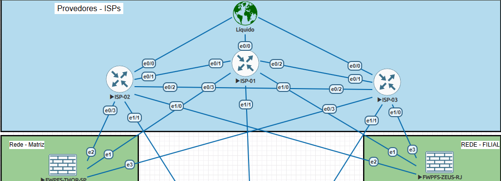
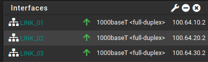
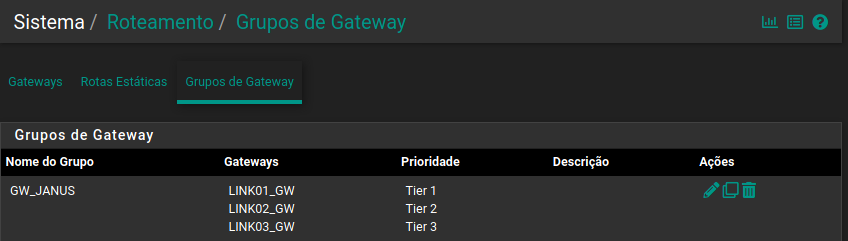
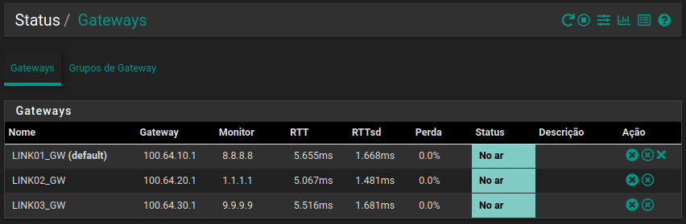
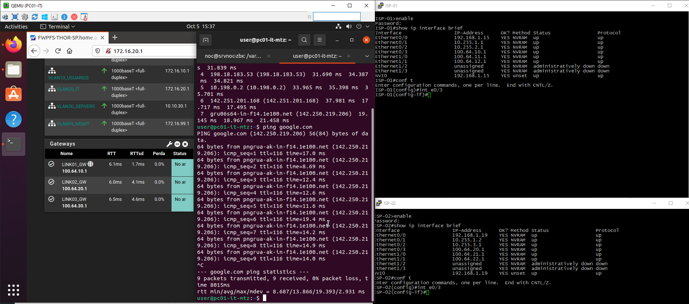
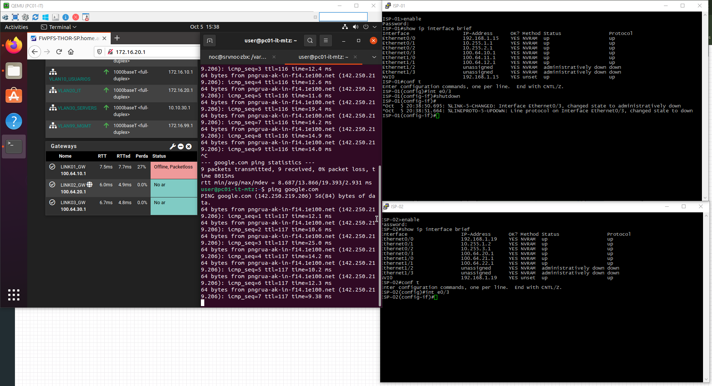
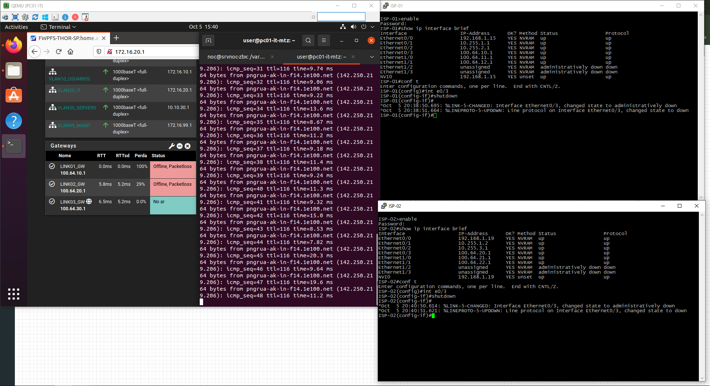
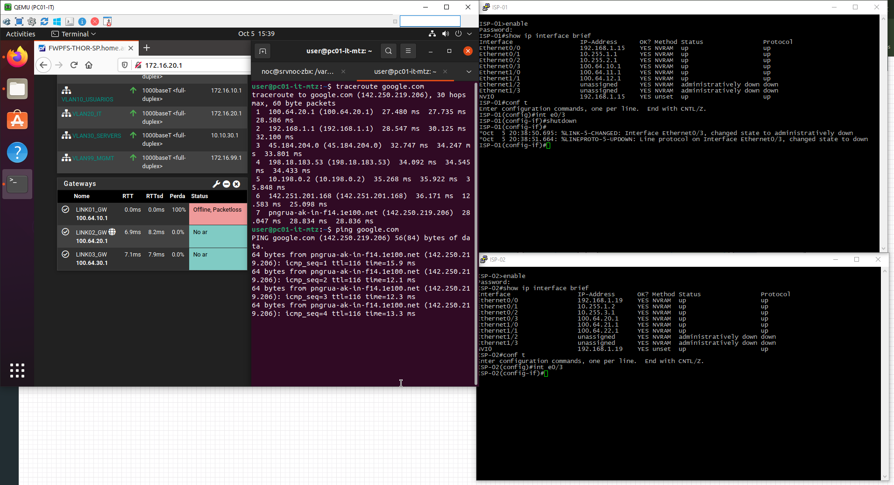
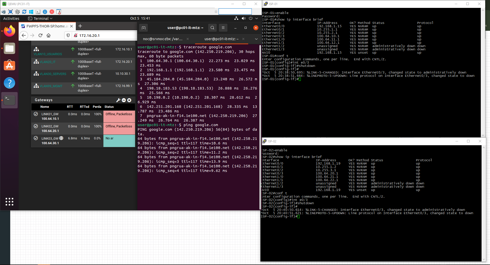
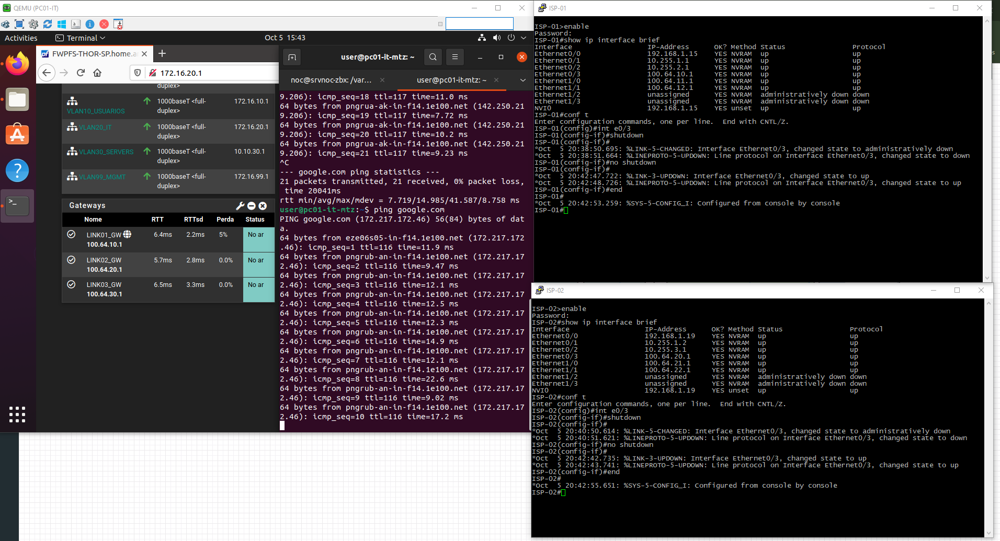

# Failover de WAN

## Objetivo

Este documento descreve a implementação de redundância de links WAN no pfSense da Matriz.

O ambiente utiliza três conexões WAN independentes, representadas no laboratório pelos provedores:

* ISP-01
* ISP-02
* ISP-03

O objetivo do mecanismo de failover é manter a conectividade externa mesmo quando uma das conexões WAN apresenta indisponibilidade.

O controle dos gateways é realizado através do grupo:

```text
GW_JANUS
```

---

## 1. Arquitetura

A Matriz possui três conexões WAN conectadas ao pfSense:

```text
                     INTERNET
                         |
          +--------------+--------------+
          |              |              |
        CLARO          VIVO             OI
          |              |              |
     100.64.10.1    100.64.20.1    100.64.30.1
          |              |              |
          +--------------+--------------+
                         |
                    pfSense MATRIZ
                         |
                    GW_JANUS
                         |
                    Rede interna
```

### Evidência — Topologia



---

## 2. Interfaces WAN

As conexões utilizadas pelo pfSense da Matriz são:

| Provedor | Rede             | IP do pfSense | Gateway       |
| -------- | ---------------- | ------------- | ------------- |
| ISP-01   | `100.64.10.0/30` | `100.64.10.2` | `100.64.10.1` |
| ISP-02   | `100.64.20.0/30` | `100.64.20.2` | `100.64.20.1` |
| ISP-03   | `100.64.30.0/30` | `100.64.30.2` | `100.64.30.1` |

Os três gateways são utilizados pelo mecanismo de monitoramento e seleção de rota do pfSense.

### Evidência — Interfaces WAN



---

# 3. Grupo de Gateways

Os gateways foram organizados no grupo:

```text
GW_JANUS
```

O grupo é utilizado pelas regras de firewall para determinar qual gateway deve ser utilizado para o tráfego externo.

Conceitualmente:

```text
                  GW_JANUS
                     |
        +------------+------------+
        |            |            |
      CLARO         VIVO          OI
     Tier 1        Tier 2       Tier 3
```

A prioridade efetiva dos links deve ser observada diretamente na configuração do grupo de gateways.

### Evidência — GW_JANUS



---

# 4. Monitoramento dos Gateways

O pfSense utiliza monitoramento dos gateways para determinar a disponibilidade dos links.

A indisponibilidade de um gateway pode fazer com que o tráfego seja direcionado para outro link disponível, conforme a prioridade configurada no grupo `GW_JANUS`.

Fluxo conceitual:

```text
                    GW_JANUS
                        |
                  Gateway primário
                        |
                  Link disponível?
                   /          \
                 SIM           NÃO
                  |             |
                  v             v
             Utilizar      Próximo gateway
             gateway       disponível
```

O monitoramento permite diferenciar uma interface fisicamente ativa de um caminho efetivamente disponível.

### Evidência — Status dos Gateways



---

# 5. Aplicação nas Regras de Firewall

As regras de firewall que necessitam de saída pela Internet podem utilizar o grupo:

```text
GW_JANUS
```

Dessa forma, o firewall não fica vinculado exclusivamente a um único gateway.

Fluxo:

```text
Cliente
   |
   v
Firewall Rule
   |
   v
GW_JANUS
   |
   +------> CLARO
   |
   +------> VIVO
   |
   +------> OI
```

A escolha do link é determinada pelo estado e pela prioridade dos gateways configurados.

### Evidência — Regra utilizando GW_JANUS


---

# 6. Cenário Normal

Com os três links disponíveis, o tráfego segue a política de prioridade configurada no grupo `GW_JANUS`.

```text
                GW_JANUS
                    |
          +---------+---------+
          |         |         |
       CLARO      VIVO        OI
       UP         UP          UP
          |
          v
       Internet
```

### Evidência — Operação Normal



---

# 7. Teste de Failover

A validação do mecanismo de redundância foi realizada simulando a indisponibilidade de um dos links WAN.

O objetivo do teste é verificar se o tráfego consegue utilizar outro gateway disponível sem necessidade de alteração manual da regra de firewall.

Fluxo esperado:

```text
              GW_JANUS
                  |
             Link primário
                  X
              INDISPONÍVEL
                  |
                  v
             Próximo link
                  |
                  v
               Internet
```

### Evidência — Antes da Falha


### Evidência — Durante a Falha





### Evidência — Após Failover





---

# 8. Validação de Conectividade

Após a indisponibilidade do link primário, foram realizados testes para verificar a continuidade da conectividade.

Exemplos de validação:

```text
Ping para endereço externo
        ↓
Teste de resolução DNS
        ↓
Acesso HTTP/HTTPS
        ↓
Verificação do gateway utilizado
```

O objetivo é verificar não somente se o gateway mudou, mas se a conectividade externa permaneceu funcional.

### Evidência — Testes


---

# 9. Recuperação do Link

Após a restauração do link que apresentou falha, o estado do gateway deve retornar ao estado operacional.

O comportamento esperado depende da política de prioridade configurada no `GW_JANUS`.

Fluxo:

```text
Link primário
     |
     X
   Falha
     |
     v
Link secundário
     |
     |
   Recuperação
     |
     v
Link primário novamente disponível
```

### Evidência — Recuperação



---

# 10. Troubleshooting

A análise de falhas de conectividade deve considerar diferentes camadas.

```text
Interface WAN
      ↓
Gateway
      ↓
Monitoramento
      ↓
Gateway Group
      ↓
Firewall Rule
      ↓
Roteamento
      ↓
NAT
      ↓
Conectividade externa
```

Em caso de falha, devem ser verificados:

* Estado físico/lógico da interface;
* Endereço IP da WAN;
* Gateway configurado;
* Estado do gateway no pfSense;
* Monitor IP;
* Grupo `GW_JANUS`;
* Regra de firewall;
* NAT;
* Rotas;
* Logs;
* Conectividade externa.

Um gateway pode estar com a interface `UP` e ainda assim apresentar indisponibilidade para alcançar o destino monitorado.

---

# 11. Resultado

O pfSense da Matriz foi configurado com redundância de conectividade através de três links WAN.

O grupo:

```text
GW_JANUS
```

centraliza a política de seleção dos gateways utilizados pelas regras que dependem de conectividade externa.

O ambiente permite realizar failover entre os links disponíveis, reduzindo o impacto de uma indisponibilidade de WAN.

A validação demonstrou o comportamento esperado de:

```text
Link primário
      ↓
    Falha
      ↓
Detecção da indisponibilidade
      ↓
Seleção de outro gateway
      ↓
Continuidade da conectividade
```
