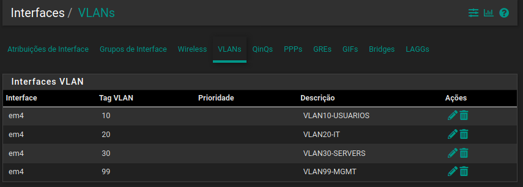
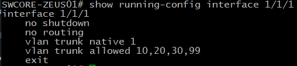

# Trunking 802.1Q

## Objetivo

Implementar e validar enlaces trunk no ambiente de laboratório, permitindo o transporte de múltiplas VLANs através de uma única interface física.

O trunking é utilizado para transportar diferentes segmentos VLAN entre equipamentos de rede, mantendo a separação lógica do tráfego.

Neste laboratório, o trunk é utilizado principalmente no enlace entre o **ArubaOS-CX Core** e o **pfSense**, transportando as VLANs utilizadas pelo ambiente corporativo.

---

## Topologia

```text
                    ArubaOS-CX Core
                  SWCORE-ZEUS01
                        |
                        |  1/1/1
                        |
                 802.1Q Trunk
              Native VLAN: 1
              Allowed: 10,20,30,99
                        |
                        |
                    pfSense
```

---

## VLANs transportadas

| VLAN | Nome     | Finalidade           |
| ---: | -------- | -------------------- |
|   10 | USUARIOS | Rede dos usuários    |
|   20 | IT       | Rede da equipe de TI |
|   30 | SERVERS  | Servidores           |
|   99 | MGMT     | Gerenciamento        |

A VLAN 1 permanece configurada como VLAN nativa do trunk.

---

## Configuração do trunk

A interface `1/1/1` do switch ArubaOS-CX foi configurada como enlace trunk:

```text
interface 1/1/1
    no shutdown
    no routing
    vlan trunk native 1
    vlan trunk allowed 10,20,30,99
    exit
```

### Características

* Interface: `1/1/1`
* Modo: trunk
* VLAN nativa: `1`
* VLANs permitidas: `10,20,30,99`
* Roteamento na interface física: desabilitado
* Encapsulamento utilizado: IEEE 802.1Q

---

## Estado operacional

A interface apresentou estado operacional ativo:

```text
Interface 1/1/1 is up
Admin state is up
Link state: up
Speed 1000 Mb/s
Full-duplex
```

A ausência de erros físicos também foi validada:

```text
Dropped   0
Errors    0
CRC/FCS   0
Runts     0
Giants    0
```

Isso permite diferenciar problemas de configuração de problemas físicos no enlace.

---

## VLANs permitidas

A configuração da porta apresenta:

```text
VLAN Mode: native-untagged
Native VLAN: 1
Allowed VLAN List: 10,20,30,99
```

A VLAN 1 é utilizada como VLAN nativa, enquanto as demais VLANs são transportadas de forma tagueada pelo trunk.

A utilização de uma lista explícita de VLANs reduz o domínio de broadcast transportado pelo enlace e evita permitir VLANs desnecessárias.

---

## Validação

### Verificação da configuração

```bash
show running-config interface 1/1/1
```

### Verificação das VLANs

```bash
show vlan
```

### Verificação operacional da interface

```bash
show interface 1/1/1
```

### Teste de conectividade da VLAN de gerenciamento

```bash
ping 172.16.99.1
```

O endereço `172.16.99.2/30` pertence à SVI da VLAN 99 no Aruba, enquanto `172.16.99.1/30` representa o gateway correspondente no pfSense.

A comunicação entre os dois dispositivos valida não apenas o estado físico do enlace, mas também o transporte da VLAN 99 através do trunk.

---

## Troubleshooting

Quando uma VLAN não apresenta conectividade através de um trunk, a análise deve considerar diferentes camadas.

### 1. Estado físico

```bash
show interface 1/1/1
```

Verificar:

* interface `up`;
* velocidade;
* duplex;
* erros;
* CRC/FCS;
* drops.

### 2. VLAN permitida

```bash
show vlan
```

Confirmar se a VLAN está presente e associada à interface.

### 3. Configuração do trunk

```bash
show running-config interface 1/1/1
```

Validar:

* modo trunk;
* VLAN nativa;
* VLANs permitidas.

### 4. SVI

Verificar se a interface VLAN correspondente possui endereço IP e está operacional.

Exemplo:

```text
interface vlan 99
    ip address 172.16.99.2/30
```

### 5. Equipamento conectado

Caso a VLAN esteja corretamente configurada no switch, deve-se verificar o equipamento na outra extremidade.

Em um enlace trunk com pfSense, a interface correspondente precisa tratar corretamente as VLANs tagueadas.

---

## Evidências

### Evidência 01 — Configuração do trunk



Comando utilizado:

```bash
show running-config interface 1/1/1
```

---

### Evidência 02 — Estado operacional



Comando utilizado:

```bash
show interface 1/1/1
```

---

### Evidência 03 — VLANs


Comando utilizado:

```bash
show vlan
```

---

### Evidência 04 — Validação da VLAN 99


Teste:

```bash
ping 172.16.99.1
```

---

## Resultado

O enlace entre o **ArubaOS-CX Core** e o **pfSense** foi configurado como trunk 802.1Q, permitindo o transporte das VLANs 10, 20, 30 e 99.

A configuração utiliza uma VLAN nativa definida e uma lista explícita de VLANs permitidas.

A validação operacional do enlace, das VLANs e da conectividade da VLAN de gerenciamento fornece evidências de funcionamento do trunk em diferentes níveis:

* camada física;
* configuração de switching;
* associação de VLAN;
* transporte 802.1Q;
* conectividade de camada 3.

Este cenário faz parte do laboratório de infraestrutura e representa uma implementação simulada de uma arquitetura corporativa.
