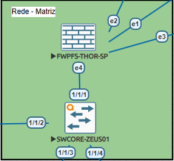
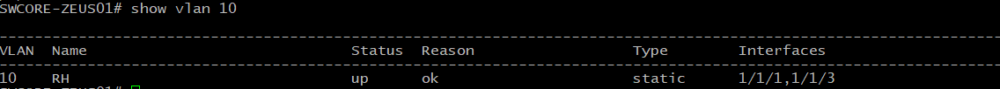
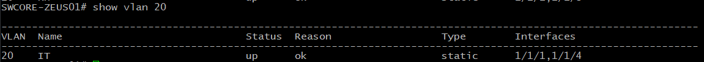
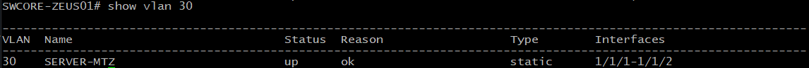
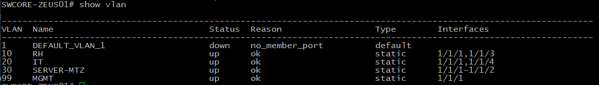
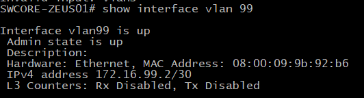
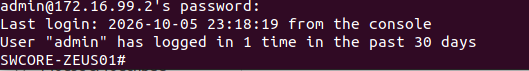
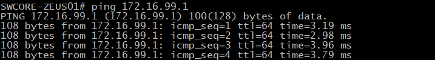

# VLANs

## Objetivo

Este documento descreve a implementação da segmentação lógica da rede utilizando VLANs no switch core ArubaOS-CX.

As VLANs foram utilizadas para separar diferentes funções da infraestrutura, reduzindo o domínio de broadcast e permitindo que o tráfego entre segmentos seja controlado pelo firewall.

O ambiente utiliza as seguintes VLANs:

| VLAN | Nome     | Rede             | Função        |
| ---: | -------- | ---------------- | ------------- |
|   10 | USUARIOS | `172.16.10.0/28` | Usuários      |
|   20 | IT       | `172.16.20.0/28` | TI            |
|   30 | SERVERS  | `10.10.30.0/30`  | Servidores    |
|   99 | MGMT     | `172.16.99.0/30` | Gerenciamento |

---

# 1. Arquitetura

A segmentação lógica da Matriz pode ser representada da seguinte forma:

```text
                         pfSense
                            |
                         TRUNK
                            |
                    +-------+-------+
                    |   Core Aruba  |
                    |    CX        |
                    +-------+-------+
                            |
          +-----------------+-----------------+
          |                 |                 |
       VLAN 10           VLAN 20           VLAN 30
      USUARIOS              IT             SERVERS
                                             |
                                          Servidores

                            |
                         VLAN 99
                           MGMT
                            |
                     Gerenciamento
```

### Evidência — Topologia VLAN



---

# 2. VLAN 10 — USUARIOS

A VLAN 10 é destinada aos dispositivos e usuários da rede corporativa.

```text
VLAN 10
USUARIOS
```

Sua finalidade é manter os dispositivos de usuários separados das redes destinadas à infraestrutura de TI, servidores e gerenciamento.

### Evidência — VLAN 10



---

# 3. VLAN 20 — IT

A VLAN 20 é destinada à rede de TI da Matriz.

```text
VLAN 20
172.16.20.0/28
```

Essa rede é utilizada para os dispositivos pertencentes ao ambiente de TI.

A separação permite aplicar políticas específicas de firewall e controle de acesso para o segmento administrativo/técnico.

### Evidência — VLAN 20



---

# 4. VLAN 30 — SERVERS

A VLAN 30 é destinada aos servidores da Matriz.

```text
VLAN 30
10.10.30.0/30
```

A separação dos servidores em uma VLAN própria permite aplicar políticas de segurança específicas entre usuários, equipe de TI e serviços de infraestrutura.

### Evidência — VLAN 30



---

# 5. VLAN 99 — MGMT

A VLAN 99 é dedicada ao gerenciamento da infraestrutura.

```text
VLAN 99
172.16.99.0/30
```

O segmento possui a seguinte estrutura de endereçamento:

```text
pfSense
172.16.99.1/30
       |
       |
Aruba Core
172.16.99.2/30
```

A utilização de uma VLAN dedicada permite separar o tráfego de gerenciamento do tráfego comum de usuários.

### Evidência — VLAN de Gerenciamento


---

# 6. Criação das VLANs

As VLANs foram criadas no switch core ArubaOS-CX.

A configuração final deve apresentar os segmentos:

```text
10   USUARIOS
20   IT
30   SERVERS
99   MGMT
```

### Evidência — Tabela de VLANs



---

# 7. Associação de Portas

As portas destinadas aos dispositivos finais são configuradas conforme a VLAN correspondente.

Exemplo conceitual:

```text
+----------------------+-------------+
| Dispositivo          | VLAN        |
+----------------------+-------------+
| Usuário              | VLAN 10     |
| Equipamento de TI    | VLAN 20     |
| Servidor             | VLAN 30     |
| Gerenciamento        | VLAN 99     |
+----------------------+-------------+
```

As portas de acesso transportam o tráfego pertencente à VLAN definida para aquele segmento.

### Evidência VLANS


---

# 8. VLAN de Gerenciamento e SSH

A VLAN 99 também foi utilizada para o gerenciamento do switch.

O endereço configurado no switch é:

```text
172.16.99.2/30
```

O gateway correspondente é:

```text
172.16.99.1
```

A comunicação pode ser representada:

```text
Administrador
      |
      | SSH
      v
172.16.99.2
Aruba Core
      |
      v
172.16.99.1
pfSense
```

A utilização de uma rede específica para gerenciamento reduz a exposição da interface administrativa às demais redes.



### Evidência acesso SSH:



---

# 9. Validação da VLAN 99

A conectividade entre o switch e o gateway foi validada através de ICMP.

Teste:

```text
Aruba Core
172.16.99.2
      |
      | ICMP
      v
pfSense
172.16.99.1
```

### Evidência — Teste de Conectividade



---

# 10. Isolamento entre Segmentos

As VLANs criam domínios de broadcast independentes.

A comunicação entre redes diferentes não ocorre simplesmente porque estão conectadas ao mesmo switch.

O tráfego entre VLANs precisa passar pelo elemento responsável pelo roteamento e pelas políticas de segurança.

No ambiente:

```text
VLAN 20
172.16.20.0/28
       |
       v
    pfSense
       |
       v
VLAN 30
10.10.30.0/30
```

Isso permite que o firewall controle quais fluxos são permitidos entre os segmentos.

---

# 11. Troubleshooting

A análise de problemas relacionados às VLANs segue uma abordagem por camadas:

```text
Interface
    ↓
VLAN
    ↓
Porta de acesso
    ↓
Trunk
    ↓
Gateway
    ↓
Roteamento
    ↓
Firewall
```

### VLAN não funciona

Verificar:

```text
1. VLAN criada?
2. Interface UP?
3. Porta associada à VLAN correta?
4. VLAN permitida no trunk?
5. Gateway configurado?
6. Endereço IP correto?
7. Firewall permitindo o tráfego?
```

### Problema de gerenciamento

Para a VLAN 99:

```text
Switch
172.16.99.2
    |
    | ping
    v
Gateway
172.16.99.1
```

Se o ping falhar, a investigação deve começar pela interface VLAN, associação da VLAN ao trunk e conectividade com o gateway.

---

# 12. Resultado

A implementação das VLANs permitiu segmentar a rede da Matriz em diferentes domínios funcionais:

```text
VLAN 10 → USUARIOS
VLAN 20 → IT
VLAN 30 → SERVERS
VLAN 99 → MGMT
```

A segmentação fornece a base para:

* Controle de acesso;
* Isolamento lógico;
* Redução de broadcast;
* Políticas específicas de firewall;
* Gerenciamento dedicado;
* Organização da infraestrutura;
* Expansão futura da rede.

A VLAN 99 também foi utilizada para gerenciamento do ArubaOS-CX através do endereço `172.16.99.2/30`, com conectividade validada até o gateway `172.16.99.1`.
