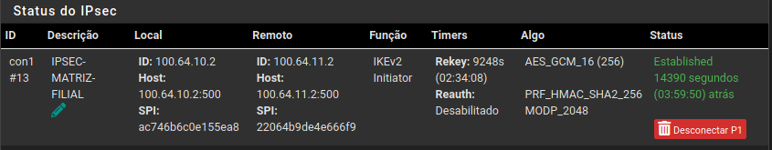
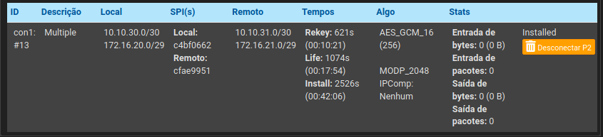
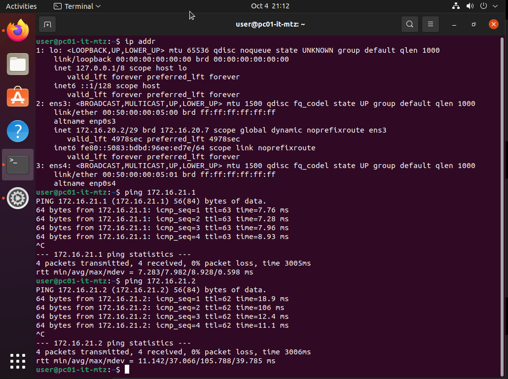
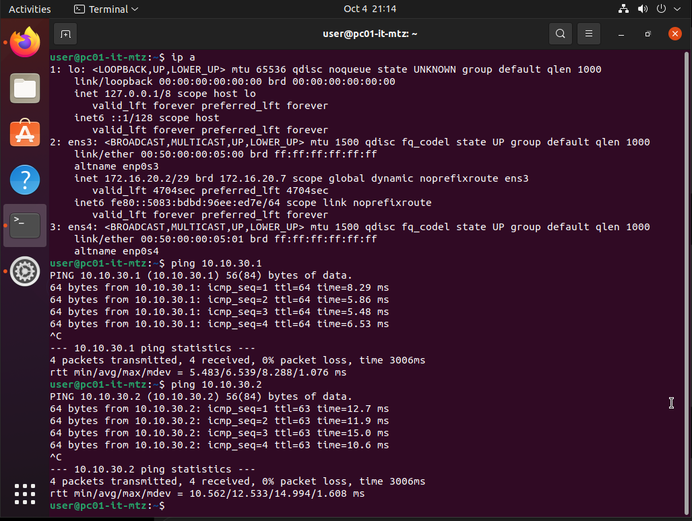

# VPN Site-to-Site — Matriz ↔ Filial

## Objetivo

Implementar comunicação segura entre as redes internas da Matriz e da Filial através de uma VPN **IPsec Site-to-Site**, utilizando pfSense nos dois extremos.

A VPN utiliza a infraestrutura WAN simulada pelos três provedores de Internet do laboratório.

---

# Arquitetura

```text
                         ISP SIMULATION
                               |
                +--------------+--------------+
                |                             |
          pfSense MATRIZ                 pfSense FILIAL
          WAN: 100.64.10.2               WAN: 100.64.11.2
                |                             |
           Core Switch                   Core Switch
                |                             |
        +-------+-------+             +-------+-------+
        |               |             |               |
     VLAN 20          VLAN 30       VLAN 21         VLAN 31
        |               |             |               |
  172.16.20.0/28   10.10.30.0/30  172.16.21.0/29  172.16.31.0/30

                    <==== IPsec ====>
```

---

# Endpoints WAN

| Site   | Firewall | WAN              | Gateway       |
| ------ | -------- | ---------------- | ------------- |
| Matriz | pfSense  | `100.64.10.2/30` | `100.64.10.1` |
| Filial | pfSense  | `100.64.11.2/30` | `100.64.11.1` |

Os endereços WAN são anunciados através da infraestrutura BGP dos ISPs simulados.

A comunicação entre os endpoints IPsec não depende de uma rota estática específica entre os firewalls. O encaminhamento entre os prefixos WAN é realizado pela infraestrutura de trânsito dos ISPs simulados.

---

# Redes Internas

## Matriz

| VLAN    | Rede             | Função     |
| ------- | ---------------- | ---------- |
| VLAN 20 | `172.16.20.0/28` | TI         |
| VLAN 30 | `10.10.30.0/30`  | Servidores |

## Filial

| VLAN    | Rede             | Função     |
| ------- | ---------------- | ---------- |
| VLAN 21 | `172.16.21.0/29` | TI         |
| VLAN 31 | `172.16.31.0/30` | Servidores |

---

# IPsec

A comunicação entre os sites foi implementada utilizando:

* IKEv2;
* IPsec;
* Autenticação por chave pré-compartilhada;
* AES-256;
* SHA-256;
* Diffie-Hellman Group 14;
* Perfect Forward Secrecy nas Phase 2.

Os parâmetros foram configurados de forma equivalente nos dois firewalls para permitir a negociação do túnel.

---

# Phase 2

Foram definidos quatro seletores de tráfego para controlar quais redes podem utilizar o túnel.

| Phase 2 | Rede local       | Rede remota      |
| ------- | ---------------- | ---------------- |
| P2-01   | `172.16.20.0/28` | `172.16.21.0/29` |
| P2-02   | `172.16.20.0/28` | `172.16.31.0/30` |
| P2-03   | `10.10.30.0/30`  | `172.16.21.0/29` |
| P2-04   | `10.10.30.0/30`  | `172.16.31.0/30` |

No firewall da Filial, os seletores são configurados de forma inversa.

```text
MATRIZ                         FILIAL

172.16.20.0/28  <---------->  172.16.21.0/29
172.16.20.0/28  <---------->  172.16.31.0/30
10.10.30.0/30   <---------->  172.16.21.0/29
10.10.30.0/30   <---------->  172.16.31.0/30
```

---

# Firewall

O estabelecimento do túnel IPsec não libera automaticamente o tráfego entre as redes internas.

Foram criadas regras específicas na interface `IPsec` dos firewalls para permitir o tráfego entre as redes autorizadas.

### Exemplo — Matriz

```text
Interface: IPsec
Action: Pass
Protocol: Any

Source:
172.16.20.0/28

Destination:
172.16.21.0/29
```

### Exemplo — Filial

```text
Interface: IPsec
Action: Pass
Protocol: Any

Source:
172.16.21.0/29

Destination:
172.16.20.0/28
```

As demais combinações seguem a mesma lógica dos seletores definidos nas Phase 2.

---

# Fluxo de comunicação

Um fluxo entre um host da Matriz e um host da Filial segue o seguinte caminho:

```text
Host Matriz
    |
    v
VLAN 20
    |
    v
Core Switch
    |
    v
pfSense Matriz
    |
    | IPsec
    v
pfSense Filial
    |
    v
Core Switch
    |
    v
VLAN 21
    |
    v
Host Filial
```

O tráfego é encapsulado pelo IPsec antes de atravessar a infraestrutura WAN entre os sites.

---

# Validação

A validação da VPN foi realizada em diferentes etapas.

## 1. Conectividade entre os endpoints

Antes da validação do IPsec, foi verificada a comunicação entre os endereços WAN dos firewalls:

```text
Matriz
100.64.10.2

        ↕

Filial
100.64.11.2
```

---

## 2. Phase 1

Foi verificado o estabelecimento da associação IKE entre os dois firewalls.

Resultado esperado:

```text
IKE / Phase 1
STATUS: UP
```
## Phase 1

A associação IKE foi estabelecida entre os firewalls.



---

## 3. Phase 2

Após o estabelecimento da Phase 1, foram verificados os quatro seletores configurados.

Resultado esperado:

```text
P2-01  UP
P2-02  UP
P2-03  UP
P2-04  UP
```

## Phase 2

Os quatro seletores de tráfego foram estabelecidos.

 

## Teste de conectividade

Foi realizado teste de comunicação entre a VLAN 20 da Matriz e a VLAN 21 da Filial.





---

## 4. Firewall

Foram verificadas as regras da interface `IPsec` e os registros de tráfego para confirmar que os pacotes estavam sendo autorizados.

---

## 5. Teste entre redes

O teste final consiste em validar comunicação entre hosts pertencentes às redes definidas nas Phase 2.

Exemplo:

```text
172.16.20.x
     |
     | ICMP
     v
172.16.21.x
```

Também são realizados testes entre as demais combinações de redes autorizadas.

---

# Troubleshooting

Durante a implementação foi identificado que o estabelecimento do túnel IPsec não implica automaticamente na liberação do tráfego entre as VLANs.

A investigação foi dividida em camadas:

```text
WAN
 ↓
Conectividade entre firewalls
 ↓
Phase 1
 ↓
Phase 2
 ↓
Firewall IPsec
 ↓
Roteamento
 ↓
Host de destino
```

Essa abordagem permite determinar em qual camada o problema está ocorrendo antes de alterar configurações.

---

# Resultado

A implementação estabeleceu uma VPN IPsec Site-to-Site entre os firewalls pfSense da Matriz e da Filial.

O túnel permite comunicação entre as redes corporativas previamente autorizadas, mantendo o controle de acesso através dos seletores IPsec e das políticas de firewall.

A arquitetura também permite a expansão posterior para utilização dos demais links WAN disponíveis no laboratório, adicionando redundância ao acesso entre os sites.
